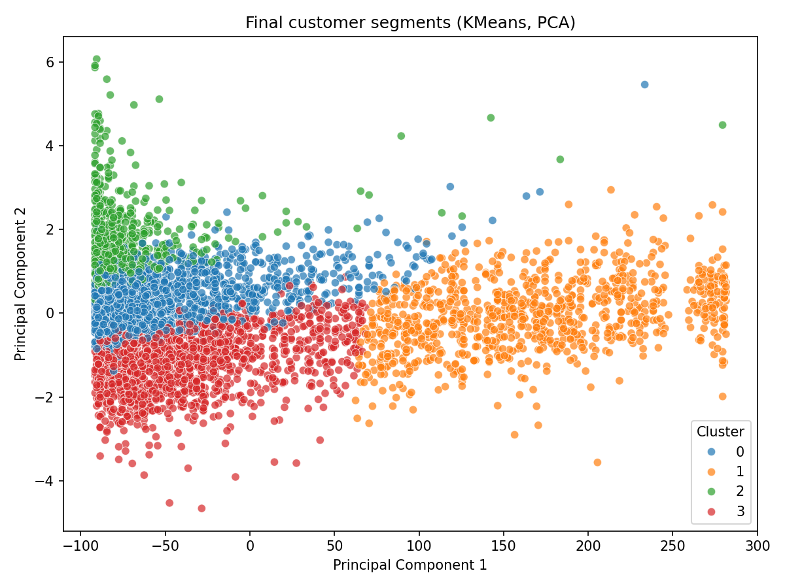
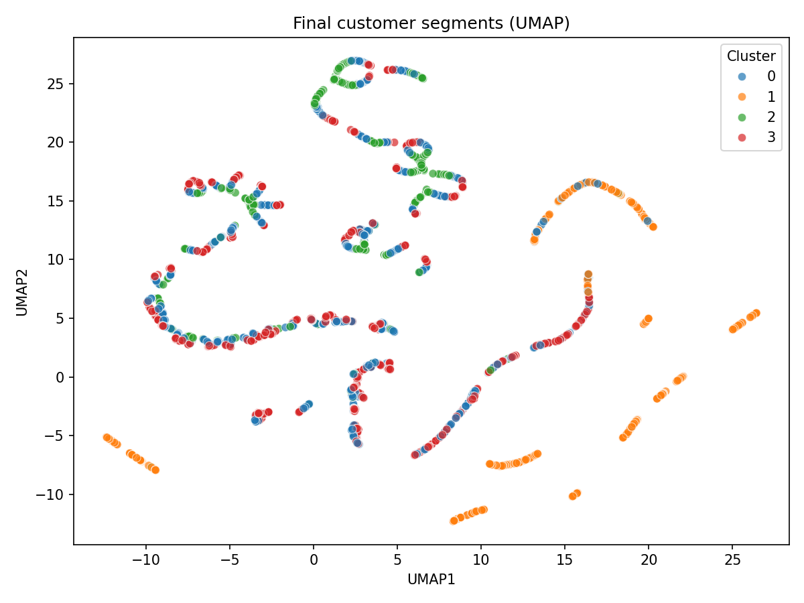
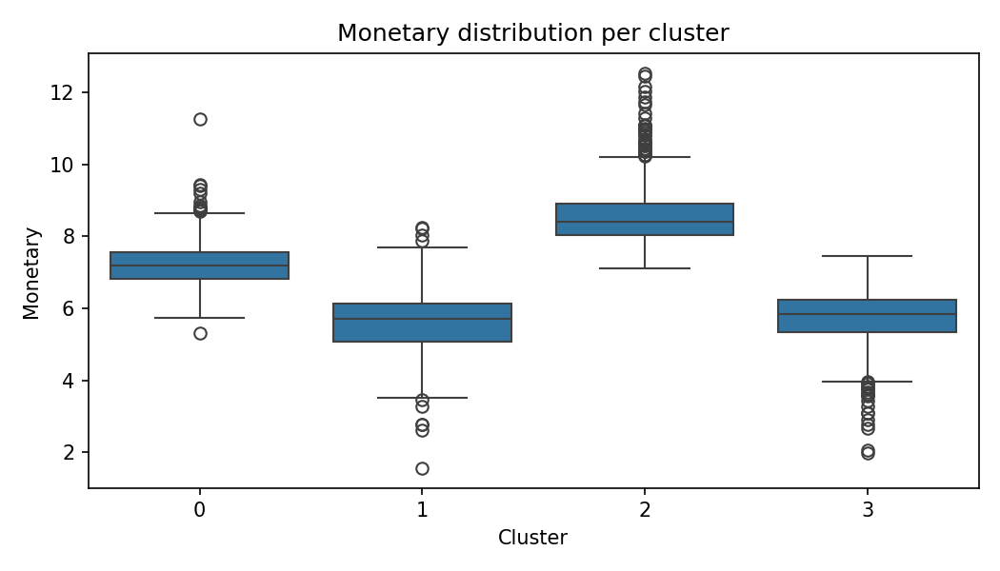
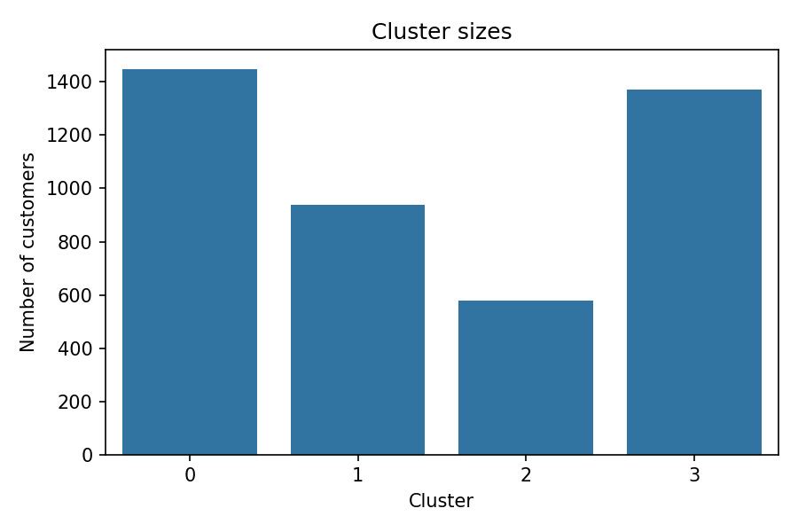

# Customer Segmentation – Clustering Analysis

This project demonstrates a complete **unsupervised machine learning workflow**
for customer segmentation based on transactional data.
The main goal is to identify meaningful customer groups that can support
business decisions such as targeted marketing, retention strategies and personalization.

---

## Project goal

The goal of this project is to:
- perform exploratory data analysis (EDA) on transactional data,
- engineer meaningful customer-level features using RFM analysis,
- apply clustering algorithms to segment customers,
- evaluate clustering quality using appropriate metrics,
- interpret and visualize resulting customer segments.

---

## Dataset

The project uses the **Online Retail Dataset**, which contains real-world
e-commerce transaction data.

Each record represents a single transaction line and includes information such as:
- invoice number and date,
- product identifier and description,
- quantity and unit price,
- customer identifier,
- country.

The dataset does **not contain predefined labels**, making it suitable for
unsupervised learning techniques such as clustering.

---

## Project structure

```
customer_segmentation/
├── data/
│   ├── raw/
│   │   └── online_retail.csv
│   └── processed/
│       └── customer_segments.csv
│
├── images/
│
│
├── notebooks/
│ └── eda.ipynb
│
├── src/
│ └── data_processing.py
│ └── evaluate.py
│ └── models.py
│ └── visualization.py
│
├── main.py
├── requirements.txt
└── README.md
```
---

## Exploratory Data Analysis (EDA)

Exploratory analysis is performed in a dedicated Jupyter notebook
(`notebooks/eda.ipynb`) to better understand the structure and quality of the data.

The EDA focuses on:
- missing values and data quality issues,
- transaction-level distributions (quantity, price, transaction value),
- customer-level behavior patterns,
- identification of outliers and skewed distributions.

Based on the EDA, data cleaning and preprocessing decisions are defined
and later implemented in the preprocessing pipeline.

---
## Data preprocessing and feature engineering

Based on the insights from exploratory data analysis, a dedicated preprocessing
module (`src/data_processing.py`) was implemented to transform raw transactional
data into a clean, customer-level dataset suitable for clustering.

The preprocessing pipeline includes the following steps:
- removal of transactions without a customer identifier,
- exclusion of cancelled invoices,
- filtering out invalid quantities and prices,
- computation of transaction-level total price,
- aggregation of transactions at the customer level using RFM analysis.

Customer behavior is summarized using the following features:
- **Recency** – number of days since the last purchase,
- **Frequency** – number of unique transactions per customer,
- **Monetary** – total spending per customer.

To address skewed distributions and reduce the impact of extreme outliers,
logarithmic transformation is applied to the Frequency and Monetary features.

---

## Clustering models

Multiple clustering algorithms were implemented and compared to explore
different perspectives on customer segmentation:

- **K-Means** – a baseline clustering approach commonly used in customer analytics,
- **Agglomerative Clustering** – a hierarchical method that does not assume spherical clusters,
- **DBSCAN** – a density-based algorithm capable of identifying noise and outliers.

All models operate on standardized RFM features to ensure fair comparison
and meaningful distance calculations.

---

## Cluster selection

The number of clusters was selected using a combination of the elbow method
and silhouette analysis. While k=3 achieved the highest silhouette score,
k=4 was chosen to provide better business interpretability while maintaining
reasonable cluster separation.
---

## Evaluation

The following metrics are used:
- **Silhouette Score** – measures how well samples are assigned to their clusters,
- **Davies–Bouldin Index** – evaluates cluster compactness and separation,
- **Inertia** (for K-Means) – used to analyze cluster compactness and support model selection.

These metrics provide complementary views on clustering quality and help assess
the strengths and limitations of each approach.

---

## Visualization and interpretation


The PCA visualization shows moderate overlap between clusters, which is expected
for real-world transactional data, while still revealing distinguishable customer groups.


UMAP visualization provides a non-linear view of customer segments and reveals
clearer local structure compared to PCA, supporting the interpretability of the identified clusters.

Cluster visualizations are used to support interpretation and validation of results:
- PCA-based scatter plots to inspect cluster separation in reduced dimensions,
- RFM feature distributions per cluster to understand behavioral differences,
- cluster size analysis to identify dominant and minor customer segments.

These visualizations help translate clustering results into actionable
business insights.

---

## Results and observations

The clustering results indicate moderate separation between customer segments,
which is typical for real-world transactional data.
Different algorithms highlight different aspects of customer behavior:

- K-Means provides a simple and interpretable baseline but shows limited separation
  with default parameters.
- Agglomerative clustering produces more compact clusters, although overall separation
  remains limited.
- DBSCAN identifies dense customer groups and potential outliers, but results are
  sensitive to parameter selection.

While clustering metrics do not indicate strongly separated clusters, the resulting
segments are interpretable in terms of customer behavior and align with common
patterns such as high-value, frequent, and inactive customers.

---

## Final customer segments

Based on RFM feature distributions and clustering results, four customer segments
were identified:

- **VIP Customers** – highly active customers with frequent purchases and the highest total spending.
- **Loyal Customers** – regularly purchasing customers with moderate to high spending, forming the core customer base.
- **At-Risk Customers** – customers with declining activity and low purchase frequency, potentially requiring retention actions.
- **Inactive Customers** – customers who have not made purchases for a long time and show minimal engagement.


RFM feature distributions, in this case monetary confirm clear behavioral differences between identified segments.


Cluster size distribution highlights the relative scale of each customer segment.

These segments provide a practical foundation for targeted marketing, retention
strategies and customer lifecycle management.

---

## Business recommendations

Based on the identified customer segments, the following high-level actions
could be considered:

- **VIP Customers**
  - priority support and exclusive offers,
  - loyalty programs to maintain engagement.

- **Loyal Customers**
  - personalized recommendations and cross-selling strategies,
  - incentives to increase purchase frequency.

- **At-Risk Customers**
  - reactivation campaigns and targeted discounts,
  - monitoring recency to prevent churn.

- **Inactive Customers**
  - win-back campaigns or re-engagement emails,
  - potential exclusion from high-cost marketing activities.

These recommendations illustrate how customer segmentation can directly
support data-driven business decisions.